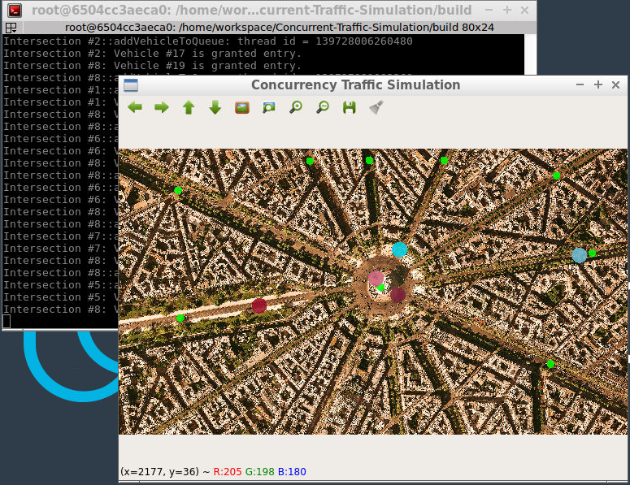

# Concurrent Traffic Simulation Project

This is a `C++ Application` named `Concurrent Traffic Simulation`,
I clone it from [Udacity account in Github](https://github.com/udacity/CppND-Program-a-Concurrent-Traffic-Simulation)
And I extend the Concurrent Traffic Simulation with some tasks for it.
Take a look at this picture and some tasks below:

## Tasks Details 
- **Task 1** : I defined a class `TrafficLight` which is a child class of `TrafficObject`. The class shall have the public methods `void waitForGreen()` and `void simulate()` as well as `TrafficLightPhase getCurrentPhase()`, where `TrafficLightPhase` is an enum that can be either `red` or `green`. Also, add the private method `void cycleThroughPhases()`. Furthermore, there shall be the private member `_currentPhase` which can take `red` or `green` as its value.
- **Task 2** : I implemented the function with an infinite loop that measures the time between two loop cycles and toggles the current phase of the traffic light between red and green and sends an update method to the message queue using move semantics. The cycle duration should be a random value between 4 and 6 seconds. Also, the while-loop should use `std::this_thread::sleep_`for to wait 1ms between two cycles. Finally, the private method `cycleThroughPhases` should be started in a thread when the public method `simulate` is called. To do this, use the thread queue in the base class.
- **Task 3** : I defined a class `MessageQueue` which has the public methods send and receive. Send should take an rvalue reference of type TrafficLightPhase whereas receive should return this type. Also, the class should define an `std::dequeue` called `_queue`, which stores objects of type `TrafficLightPhase`. Finally, there should be an `std::condition_variable` as well as an `std::mutex` as private members.
- **Task 4** : I implement the method `Send`, which should use the mechanisms `std::lock_guard<std::mutex>` as well as `_condition.notify_one()` to add a new message to the queue and afterwards send a notification. Also, in class `TrafficLight`, create a private member of type `MessageQueue` for messages of type `TrafficLightPhase` and use it within the infinite loop to push each new `TrafficLightPhase` into it by calling send in conjunction with move semantics.
- **Task 5** : I used the method receive `std::unique_lock<std::mutex>` and `_condition.wait()` to wait for and receive new messages and pull them from the queue using move semantics. The received object should then be returned by the receive function. Then, add the implementation of the method `waitForGreen`, in which an infinite while-loop runs and repeatedly calls the `receive` function on the message queue. Once it receives `TrafficLightPhase::green`, the method returns.
- **Task 6** : In class Intersection, added a private member `_trafficLight` of type `TrafficLight`. In method `Intersection::simulate()`, start the simulation of `_trafficLight`. Then, in method `Intersection::addVehicleToQueue`, use the methods `TrafficLight::getCurrentPhase` and `TrafficLight::waitForGreen` to block the execution until the traffic light turns green.

## Dependencies for Running Locally
* cmake >= 2.8
  * All OSes: [click here for installation instructions](https://cmake.org/install/)
* make >= 4.1 (Linux, Mac), 3.81 (Windows)
  * Linux: make is installed by default on most Linux distros
  * Mac: [install Xcode command line tools to get make](https://developer.apple.com/xcode/features/)
  * Windows: [Click here for installation instructions](http://gnuwin32.sourceforge.net/packages/make.htm)
* OpenCV >= 4.1
  * The OpenCV 4.1.0 source code can be found [here](https://github.com/opencv/opencv/tree/4.1.0)
* gcc/g++ >= 5.4
  * Linux: gcc / g++ is installed by default on most Linux distros
  * Mac: same deal as make - [install Xcode command line tools](https://developer.apple.com/xcode/features/)
  * Windows: recommend using [MinGW](http://www.mingw.org/)

## Steps
In this project, I extend this concurrent traffic simulation with some tasks, To build and run the application, first make the steps bellow:

## Build and Run Project
1. Clone this repo.
2. Make a build directory in the top level directory: `mkdir build && cd build`
3. Compile: `cmake .. && make`
4. Run it: `./traffic_simulation`.

## Conclusion
This project let us know how to create C++ application with best structure and create modern models and high secure, use and control memory with best way.